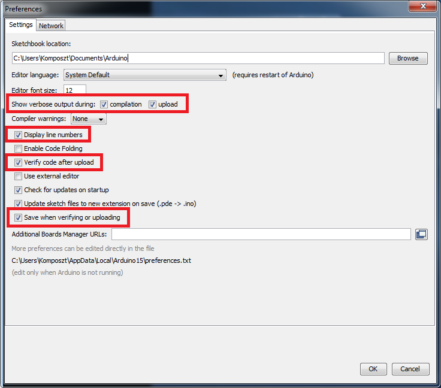

# Arduino Config Pack

This is for the UPRA Arduino environment. Contains the proper bootloaders and modified Print.h for printf function.

# How to use

1. Unpack 'arduino_config_pack.zip' to your __Arduino IDE__ application library
2. Overwrite the existing files
3. Restart __Arduino IDE__

# Set up Arduino IDE

1. Open preferences: File->Preferences
2. Make sure the following checkboxes are checked:

   Show verbose output during: [x] compilation  [x] upload
   * [x] Display line numbers
   * [x] Verify code after upload
   * [x] Save when verifying or upload
   
   
3. Save by click on __OK__
